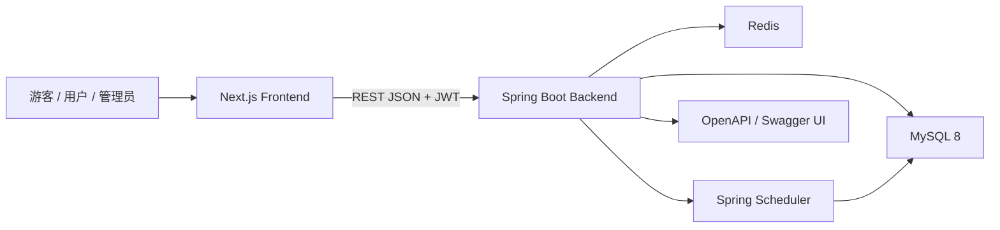
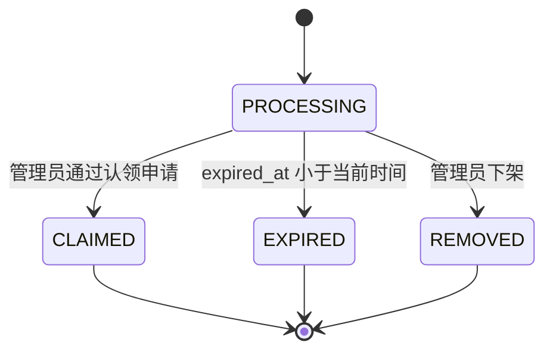
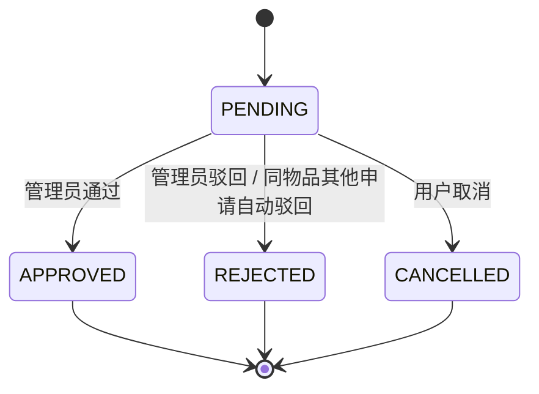
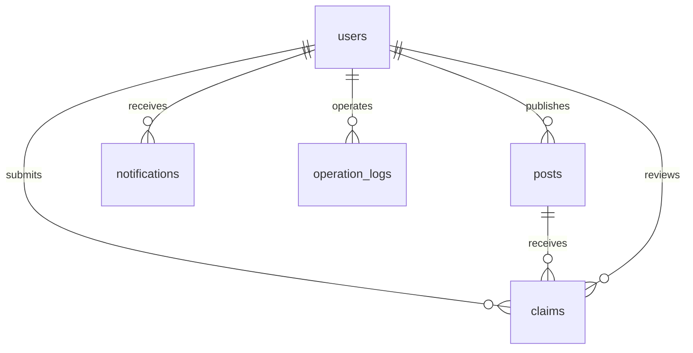
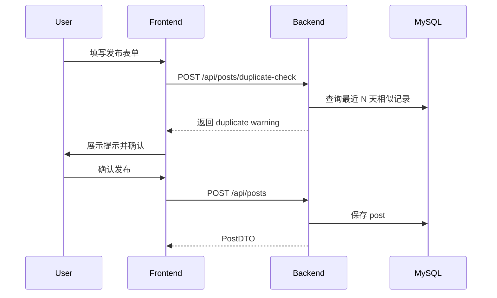
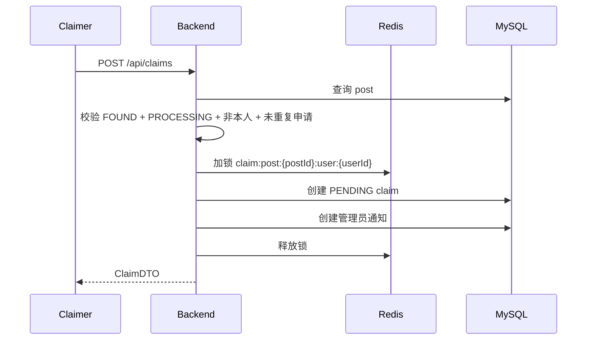
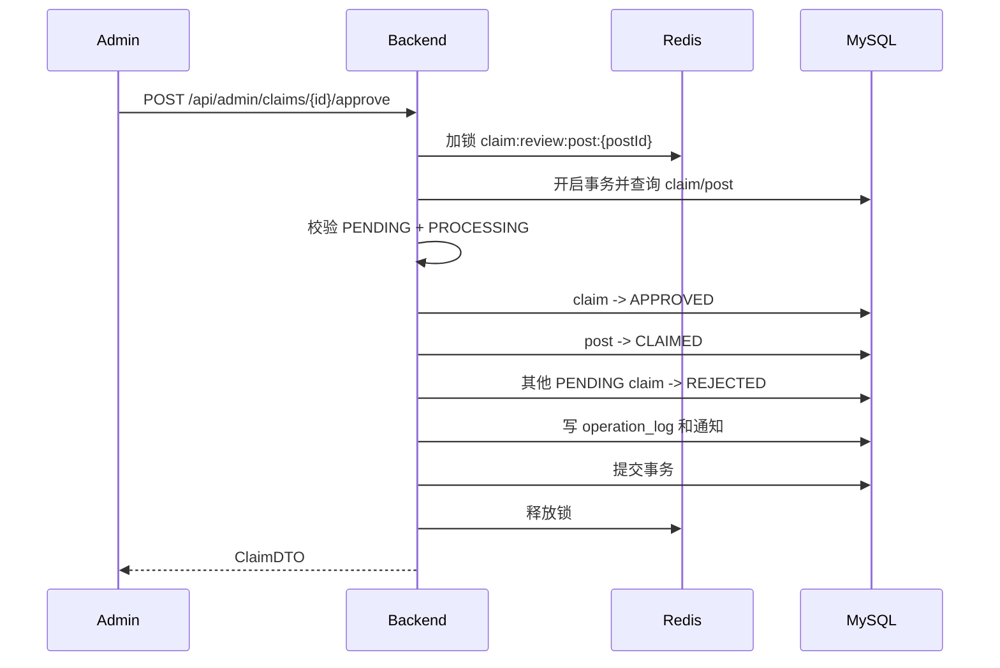
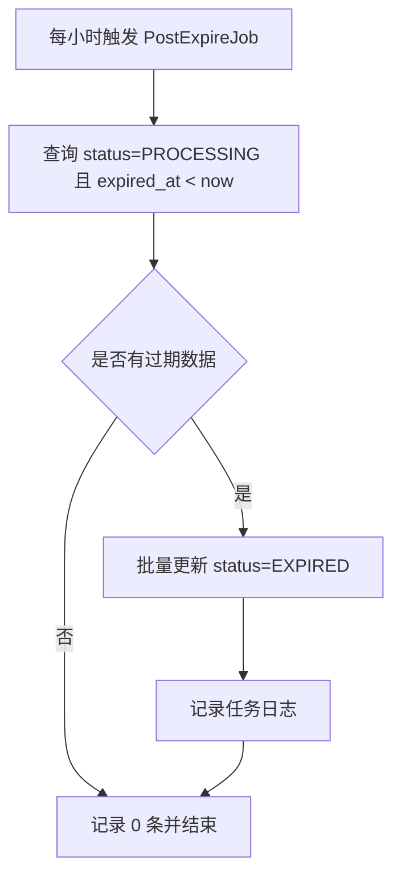
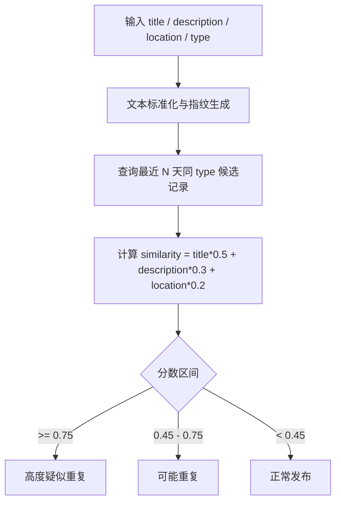

# 第一阶段：校园失物招领管理系统完整架构规划

## 1. 项目总体架构

系统采用前后端分离架构：

- 前端由 Next.js App Router 承载页面、路由、组件、表单校验、客户端状态和 API 调用。
- 后端由 Spring Boot 提供 REST API、认证鉴权、业务流程、状态流转、数据库持久化、缓存和定时任务。
- MySQL 负责用户、物品、认领申请、通知、操作日志等核心业务数据。
- Redis 负责认领申请并发锁、热点统计缓存、登录辅助缓存和后续扩展的重复校验缓存。
- 认证采用 JWT。登录成功后前端保存 token，Axios 请求自动携带 `Authorization: Bearer <token>`。
- 权限采用角色模型：`VISITOR`、`USER`、`ADMIN`、`SUPER_ADMIN`。
- 状态机覆盖物品状态和认领申请状态，所有核心流转统一放在后端 Domain Service 中处理。

### 架构视图



### 状态机



认领申请状态：



## 2. 功能模块拆分

| 模块 | 职责 | 核心对象 |
| --- | --- | --- |
| 用户认证模块 | 注册、登录、JWT 签发、当前用户查询、登出 | LoginRequest、RegisterRequest、AuthResponse |
| 用户管理模块 | 用户资料、角色、状态、管理员用户列表 | User、UserRole |
| 失物 / 拾物信息模块 | 发布、编辑、删除、详情、列表、筛选、分页、重复检测 | Post、PostType、PostStatus |
| 认领申请模块 | 提交认领、查看个人申请、取消申请 | Claim、ClaimStatus |
| 管理员审核模块 | 审核通过、驳回、下架、全部数据管理 | ClaimReviewRequest、OperationLog |
| 通知模块 | 认领申请、审核结果、状态变化通知 | Notification |
| 操作日志模块 | 记录管理员审核、下架、角色变更等关键操作 | OperationLog |
| 定时任务模块 | 扫描过期物品并更新状态 | PostExpireJob |
| 统计模块 | 首页与后台统计卡片、状态分布 | AdminStatsDTO |

## 3. 数据库 ER 设计

### 表清单

| 表 | 说明 |
| --- | --- |
| `users` | 用户账号、密码哈希、角色和状态 |
| `posts` | 失物 / 拾物信息 |
| `claims` | 认领申请与审核结果 |
| `notifications` | 用户通知 |
| `operation_logs` | 管理员操作日志 |

### 表关系



### 字段设计

`users`：

- `id`
- `username`
- `password_hash`
- `nickname`
- `email`
- `phone`
- `role`
- `status`
- `created_at`
- `updated_at`

`posts`：

- `id`
- `title`
- `type`
- `category`
- `description`
- `image_url`
- `location`
- `occurred_at`
- `contact`
- `status`
- `owner_id`
- `duplicate_score`
- `expired_at`
- `created_at`
- `updated_at`
- `version`
- `deleted`

`claims`：

- `id`
- `post_id`
- `claimer_id`
- `reason`
- `proof_description`
- `status`
- `review_comment`
- `reviewer_id`
- `reviewed_at`
- `created_at`
- `updated_at`
- `version`
- `deleted`

`notifications`：

- `id`
- `user_id`
- `title`
- `content`
- `type`
- `read_status`
- `created_at`

`operation_logs`：

- `id`
- `operator_id`
- `action`
- `target_type`
- `target_id`
- `detail`
- `ip`
- `created_at`

### 索引设计

| 索引 | 表 | 字段 |
| --- | --- | --- |
| `idx_post_type_status_created_at` | `posts` | `type, status, created_at` |
| `idx_post_owner_id` | `posts` | `owner_id` |
| `idx_post_expired_at_status` | `posts` | `expired_at, status` |
| `idx_claim_post_id_status` | `claims` | `post_id, status` |
| `idx_claim_claimer_id` | `claims` | `claimer_id` |
| `idx_user_username` | `users` | `username` |
| `idx_user_email` | `users` | `email` |

### 状态枚举

- `PostType`: `LOST`, `FOUND`
- `PostStatus`: `PROCESSING`, `CLAIMED`, `EXPIRED`, `REMOVED`
- `ClaimStatus`: `PENDING`, `APPROVED`, `REJECTED`, `CANCELLED`
- `UserRole`: `VISITOR`, `USER`, `ADMIN`, `SUPER_ADMIN`
- `UserStatus`: `ACTIVE`, `DISABLED`

### 关键约束

- `users.username` 唯一。
- `users.email` 唯一。
- 同一用户对同一物品最多保留一条未删除申请。
- 只有 `FOUND + PROCESSING` 的物品允许申请认领。
- 发布者不能认领自己发布的拾物信息。
- 通过某个申请后，同物品其他 `PENDING` 申请自动变为 `REJECTED`。
- `posts` 和 `claims` 使用 `version` 支持乐观锁。
- `deleted` 用于软删除。

## 4. REST API 设计

统一响应：

```json
{
  "code": 0,
  "message": "success",
  "data": {}
}
```

统一分页：

```json
{
  "records": [],
  "total": 100,
  "page": 1,
  "pageSize": 10
}
```

| Method | Path | Auth | Description | Request DTO | Response DTO |
| --- | --- | --- | --- | --- | --- |
| POST | `/api/auth/register` | Public | 用户注册 | `RegisterRequest` | `AuthResponse` |
| POST | `/api/auth/login` | Public | 用户登录 | `LoginRequest` | `AuthResponse` |
| GET | `/api/auth/me` | USER | 当前用户 | - | `UserDTO` |
| POST | `/api/auth/logout` | USER | 登出 | - | `Void` |
| GET | `/api/posts` | Public | 物品列表 | `PostQueryRequest` | `PageResult<PostDTO>` |
| GET | `/api/posts/{id}` | Public | 物品详情 | - | `PostDTO` |
| POST | `/api/posts` | USER | 发布物品 | `PostCreateRequest` | `PostDTO` |
| PUT | `/api/posts/{id}` | USER | 更新本人发布 | `PostUpdateRequest` | `PostDTO` |
| DELETE | `/api/posts/{id}` | USER | 删除本人发布 | - | `Void` |
| POST | `/api/posts/duplicate-check` | USER | 重复发布检测 | `PostCreateRequest` | `DuplicateCheckResponse` |
| POST | `/api/posts/{id}/remove` | ADMIN | 管理员下架 | `RemovePostRequest` | `Void` |
| POST | `/api/claims` | USER | 提交认领申请 | `ClaimCreateRequest` | `ClaimDTO` |
| GET | `/api/claims/my` | USER | 我的认领申请 | `ClaimQueryRequest` | `PageResult<ClaimDTO>` |
| GET | `/api/claims/{id}` | USER | 申请详情 | - | `ClaimDTO` |
| POST | `/api/claims/{id}/cancel` | USER | 取消申请 | - | `ClaimDTO` |
| GET | `/api/admin/stats` | ADMIN | 管理员统计 | - | `AdminStatsDTO` |
| GET | `/api/admin/posts` | ADMIN | 管理全部物品 | `PostQueryRequest` | `PageResult<PostDTO>` |
| GET | `/api/admin/claims` | ADMIN | 管理全部申请 | `ClaimQueryRequest` | `PageResult<ClaimDTO>` |
| POST | `/api/admin/claims/{id}/approve` | ADMIN | 审核通过 | `ClaimReviewRequest` | `ClaimDTO` |
| POST | `/api/admin/claims/{id}/reject` | ADMIN | 审核驳回 | `ClaimReviewRequest` | `ClaimDTO` |
| POST | `/api/admin/posts/{id}/remove` | ADMIN | 下架物品 | `RemovePostRequest` | `Void` |
| GET | `/api/admin/users` | ADMIN | 用户列表 | `UserQueryRequest` | `PageResult<UserDTO>` |
| PUT | `/api/admin/users/{id}/role` | ADMIN | 修改角色 | `UserRoleUpdateRequest` | `UserDTO` |
| GET | `/api/notifications` | USER | 通知列表 | `NotificationQueryRequest` | `PageResult<NotificationDTO>` |
| POST | `/api/notifications/{id}/read` | USER | 标记已读 | - | `Void` |
| POST | `/api/notifications/read-all` | USER | 全部已读 | - | `Void` |

## 5. 前端页面设计

| 路由 | 页面功能 | 主要组件 | API |
| --- | --- | --- | --- |
| `/` | 首页统计、最新失物、最新拾物、快捷入口 | `AdminStatsCards`, `PostCard`, `FilterBar` | `GET /api/admin/stats`, `GET /api/posts` |
| `/login` | 登录 | `AuthForm` | `POST /api/auth/login` |
| `/register` | 注册 | `AuthForm` | `POST /api/auth/register` |
| `/posts` | 列表、搜索、筛选、分页、排序 | `PostCard`, `PostTable`, `FilterBar` | `GET /api/posts` |
| `/posts/[id]` | 详情、状态 Timeline、申请认领入口 | `PostDetail`, `ClaimDialog`, `ClaimTimeline` | `GET /api/posts/{id}`, `POST /api/claims` |
| `/posts/create` | 发布表单、重复检测提示 | `PostForm`, `DuplicateCheckHint` | `POST /api/posts/duplicate-check`, `POST /api/posts` |
| `/claims` | 我的申请 | `ClaimTable`, `ClaimStatusBadge` | `GET /api/claims/my` |
| `/admin` | 后台首页 | `AdminStatsCards`, `PendingClaimPanel` | `GET /api/admin/stats` |
| `/admin/posts` | 全部物品管理、下架 | `PostTable`, `ReviewActionPanel` | `GET /api/admin/posts`, `POST /api/admin/posts/{id}/remove` |
| `/admin/claims` | 审核认领申请 | `ClaimTable`, `ReviewActionPanel` | `GET /api/admin/claims`, approve/reject |
| `/admin/users` | 用户管理 | `UserRoleBadge`, `DataTable` | `GET /api/admin/users`, `PUT /api/admin/users/{id}/role` |

### 状态管理

- `Zustand`: 保存用户会话、token、角色、基础偏好。
- `TanStack Query`: 管理列表、详情、统计、提交、审核等服务端状态。
- `React Hook Form + Zod`: 管理表单值和前端校验。
- `Axios`: 请求封装，自动注入 JWT，统一处理 401。

## 6. 后端分层设计

| 层 | 职责 |
| --- | --- |
| Controller | 接收 HTTP 请求、参数校验、权限注解、调用 Service，不写复杂业务 |
| Service | 应用服务，组合查询、事务边界、DTO 转换、调用 Domain Service |
| Domain Service | 核心业务状态流转，例如认领申请、审核通过、重复检测、过期规则 |
| Mapper | MyBatis-Plus 数据访问，不放业务判断 |
| Entity | 数据库映射对象 |
| DTO | 请求和响应对象，与 Entity 分离 |
| Security | JWT 解析、认证上下文、角色校验、CORS |
| Job | 定时扫描过期物品并更新状态 |

## 7. 核心业务流程图

### 发布流程



### 认领申请流程



### 管理员审核流程



### 自动过期流程



### 重复检测流程



## 8. 开发阶段计划

| 阶段 | 目标 | 产物 | 关键文件 | 验收标准 |
| --- | --- | --- | --- | --- |
| Phase 0：项目初始化 | 建立前后端、SQL、文档目录 | 基础目录、README、docs、docker-compose | `README.md`, `docs/*`, `docker-compose.yml` | 目录完整、文档可读、MySQL/Redis 可启动 |
| Phase 1：数据库与后端基础框架 | 搭建 Spring Boot、MyBatis-Plus、MySQL、Redis | 后端骨架、配置、实体、Mapper | `backend/pom.xml`, `application.yml`, entity/mapper | 后端启动成功、数据库连接成功 |
| Phase 2：认证与权限 | 实现注册登录、JWT、角色权限 | Auth API、Security 配置、测试账号 | `AuthController`, `SecurityConfig`, `JwtTokenProvider` | 可登录、可获取当前用户、权限拦截正确 |
| Phase 3：Post 模块 | 实现发布、列表、详情、筛选、重复检测 | Post API、重复检测服务 | `PostController`, `PostService`, `PostDomainService` | CRUD、分页、筛选和 duplicate-check 可用 |
| Phase 4：Claim 审核流 | 实现认领申请、取消、审核通过/驳回 | Claim API、状态流转、事务和锁 | `ClaimController`, `ClaimService`, `ClaimDomainService` | 审核通过后 post/claim 状态一致 |
| Phase 5：管理员后台 | 实现统计、全部管理、用户角色、日志 | Admin API、日志服务 | `AdminController`, `AdminService`, `OperationLogService` | 管理员可审核、下架、查看统计 |
| Phase 6：前端页面 | 实现 Next.js 页面和组件 | 前端路由、组件、状态管理 | `frontend/app/*`, `components/*`, `lib/*` | 演示流程在页面可完成 |
| Phase 7：联调与测试 | 前后端联调、测试用例、缺陷修复 | 接口测试、端到端流程验证 | `docs/07-test-cases.md` | 五条核心演示流程通过 |
| Phase 8：文档与课程提交材料 | 补齐 README、截图、AI 使用说明 | 完整提交材料 | `README.md`, `docs/screenshots/*`, `docs/09-ai-usage.md` | 可按课程要求提交 |

