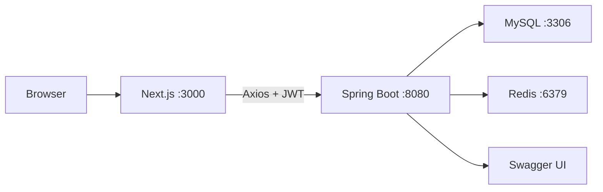

# 系统架构设计

## 架构原则

- 前后端分离：前端只负责 UI、交互和 API 调用，后端负责认证、权限、业务规则和数据持久化。
- 分层清晰：Controller 不写复杂业务，Service 组织应用流程，Domain Service 处理核心状态流转，Mapper 只做数据访问。
- 状态集中：物品状态和认领状态由后端统一控制，前端只展示后端结果。
- 并发可控：审核通过流程通过事务、乐观锁和 Redis 锁保证一致性。
- 可演示优先：功能范围覆盖课程要求，复杂算法保留扩展点但不影响本地运行。

## 运行架构



## 前端架构

- App Router 管理页面路由。
- Server Component 用于静态布局和基础页面壳。
- Client Component 用于表单、弹窗、列表交互、动画。
- TanStack Query 管理服务端数据缓存和 mutation。
- Zustand 管理 token、用户、角色等客户端会话状态。
- Axios 实现统一请求、鉴权头注入和 401 处理。

## 后端架构

- Spring Web 提供 REST API。
- Spring Security + JWT 实现无状态认证。
- Spring Validation 做参数校验。
- MyBatis-Plus 提供 CRUD、分页、乐观锁和逻辑删除能力。
- Redis 用于锁、缓存和后续扩展。
- Spring Scheduler 执行自动过期任务。
- SpringDoc OpenAPI 生成接口文档。

## 状态机设计

物品状态：

```text
PROCESSING -> CLAIMED  管理员通过认领申请
PROCESSING -> EXPIRED  超过 expired_at
PROCESSING -> REMOVED  管理员下架
```

认领申请状态：

```text
PENDING -> APPROVED
PENDING -> REJECTED
PENDING -> CANCELLED
```

## 权限模型

| 接口类型 | VISITOR | USER | ADMIN |
| --- | --- | --- | --- |
| 浏览公开物品 | 允许 | 允许 | 允许 |
| 发布物品 | 拒绝 | 允许 | 允许 |
| 申请认领 | 拒绝 | 允许 | 允许 |
| 审核认领 | 拒绝 | 拒绝 | 允许 |
| 下架物品 | 拒绝 | 拒绝 | 允许 |
| 用户管理 | 拒绝 | 拒绝 | 允许 |

