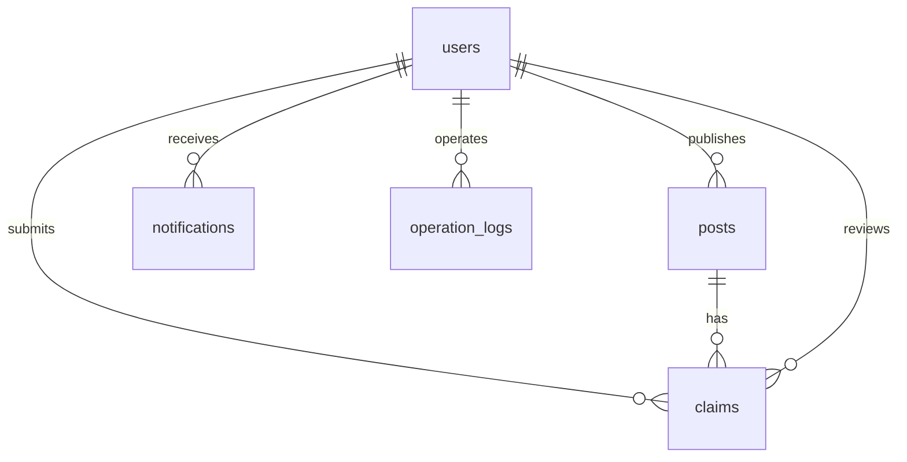

# 数据库设计

## 表清单

| 表名 | 说明 |
| --- | --- |
| `users` | 用户账号、角色、状态 |
| `posts` | 失物 / 拾物信息 |
| `claims` | 认领申请 |
| `notifications` | 用户通知 |
| `operation_logs` | 管理员操作日志 |

## ER 图

## 枚举

| 枚举 | 值 |
| --- | --- |
| `UserRole` | `USER`, `ADMIN`, `SUPER_ADMIN` |
| `UserStatus` | `ACTIVE`, `DISABLED` |
| `PostType` | `LOST`, `FOUND` |
| `PostStatus` | `PROCESSING`, `CLAIMED`, `EXPIRED`, `REMOVED` |
| `ClaimStatus` | `PENDING`, `APPROVED`, `REJECTED`, `CANCELLED` |
| `NotificationType` | `CLAIM_CREATED`, `CLAIM_APPROVED`, `CLAIM_REJECTED`, `POST_EXPIRED`, `SYSTEM` |

## 关键字段

### users

| 字段 | 类型 | 说明 |
| --- | --- | --- |
| `id` | bigint | 主键 |
| `username` | varchar(64) | 登录名，唯一 |
| `password_hash` | varchar(100) | BCrypt 密码哈希 |
| `nickname` | varchar(64) | 昵称 |
| `email` | varchar(128) | 邮箱，唯一 |
| `phone` | varchar(32) | 手机号 |
| `role` | varchar(32) | 角色 |
| `status` | varchar(32) | 用户状态 |
| `created_at` | datetime | 创建时间 |
| `updated_at` | datetime | 更新时间 |

### posts

| 字段 | 类型 | 说明 |
| --- | --- | --- |
| `id` | bigint | 主键 |
| `title` | varchar(100) | 标题 |
| `type` | varchar(16) | LOST / FOUND |
| `category` | varchar(64) | 分类 |
| `description` | text | 描述 |
| `image_url` | varchar(512) | 图片地址 |
| `location` | varchar(128) | 地点 |
| `occurred_at` | datetime | 发生时间 |
| `contact` | varchar(128) | 联系方式 |
| `status` | varchar(32) | 物品状态 |
| `owner_id` | bigint | 发布人 |
| `duplicate_score` | decimal(5,4) | 重复检测分数 |
| `expired_at` | datetime | 过期时间 |
| `version` | int | 乐观锁版本 |
| `deleted` | tinyint | 软删除 |

### claims

| 字段 | 类型 | 说明 |
| --- | --- | --- |
| `id` | bigint | 主键 |
| `post_id` | bigint | 关联物品 |
| `claimer_id` | bigint | 申请人 |
| `reason` | varchar(512) | 认领理由 |
| `proof_description` | varchar(1000) | 证明说明 |
| `status` | varchar(32) | 申请状态 |
| `review_comment` | varchar(512) | 审核备注 |
| `reviewer_id` | bigint | 审核人 |
| `reviewed_at` | datetime | 审核时间 |
| `version` | int | 乐观锁版本 |
| `deleted` | tinyint | 软删除 |

## 索引

| 索引 | 表 | 用途 |
| --- | --- | --- |
| `idx_post_type_status_created_at` | `posts` | 列表筛选和排序 |
| `idx_post_owner_id` | `posts` | 查询用户发布 |
| `idx_post_expired_at_status` | `posts` | 自动过期任务 |
| `idx_claim_post_id_status` | `claims` | 审核和重复申请判断 |
| `idx_claim_claimer_id` | `claims` | 我的申请 |
| `idx_user_username` | `users` | 登录查询 |
| `idx_user_email` | `users` | 注册唯一性校验 |

## SQL 文件

- 建表 SQL：[../sql/schema.sql](../sql/schema.sql)
- 初始化数据：[../sql/data.sql](../sql/data.sql)

