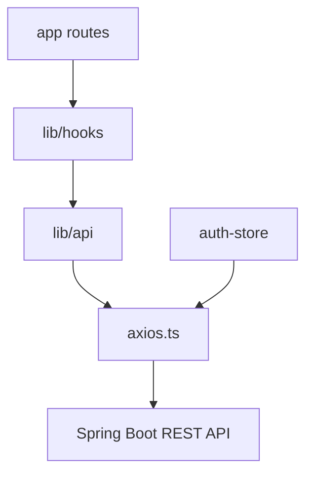

# 前端设计

## 目录结构

```text
frontend/
├── app/
│   ├── page.tsx
│   ├── layout.tsx
│   ├── login/page.tsx
│   ├── register/page.tsx
│   ├── posts/page.tsx
│   ├── posts/[id]/page.tsx
│   ├── posts/create/page.tsx
│   ├── claims/page.tsx
│   ├── admin/page.tsx
│   ├── admin/posts/page.tsx
│   ├── admin/claims/page.tsx
│   └── admin/users/page.tsx
├── components/
│   ├── layout/
│   ├── posts/
│   ├── claims/
│   ├── admin/
│   └── common/
├── lib/
│   ├── api/
│   ├── hooks/
│   ├── store/
│   ├── types/
│   └── utils/
└── middleware.ts
```

## 页面路由

| 路由 | 功能 |
| --- | --- |
| `/` | Dashboard、统计卡片、最新发布、快捷操作 |
| `/login` | 登录 |
| `/register` | 注册 |
| `/posts` | 失物 / 拾物列表 |
| `/posts/[id]` | 详情和申请认领 |
| `/posts/create` | 发布失物 / 拾物 |
| `/claims` | 我的认领申请 |
| `/admin` | 管理员后台首页 |
| `/admin/posts` | 物品管理 |
| `/admin/claims` | 认领审核 |
| `/admin/users` | 用户管理 |

## 组件拆分

| 目录 | 组件 |
| --- | --- |
| `components/layout` | `AppShell`, `Header`, `Sidebar`, `MobileNav` |
| `components/posts` | `PostCard`, `PostTable`, `PostForm`, `PostDetail`, `PostStatusBadge`, `PostTypeBadge`, `DuplicateCheckHint`, `ExpiryCountdown` |
| `components/claims` | `ClaimDialog`, `ClaimTable`, `ClaimStatusBadge`, `ClaimTimeline` |
| `components/admin` | `AdminStatsCards`, `PendingClaimPanel`, `ReviewActionPanel`, `UserRoleBadge` |
| `components/common` | `DataTable`, `FilterBar`, `EmptyState`, `LoadingSkeleton`, `ConfirmDialog` |

## 状态管理

- `auth-store`: 保存 token、当前用户、角色和登录状态。
- `usePosts`: 列表、详情、发布、更新、删除、重复检测。
- `useClaims`: 提交申请、我的申请、取消申请。
- `useAdminStats`: 后台统计。
- `useAdminClaims`: 管理员审核申请。

## API 调用关系



## UI 风格

- 现代校园 SaaS 管理系统。
- 卡片式布局、轻阴影、subtle border、统一圆角。
- LOST 使用 amber / orange，FOUND 使用 blue。
- PROCESSING 使用 blue，CLAIMED 使用 green，EXPIRED 使用 gray，REMOVED 使用 muted red。
- PENDING 使用 yellow，APPROVED 使用 green，REJECTED 使用 red。
- Framer Motion 用于页面进入、列表 stagger、卡片 hover、Dialog 和 Timeline 动效。

